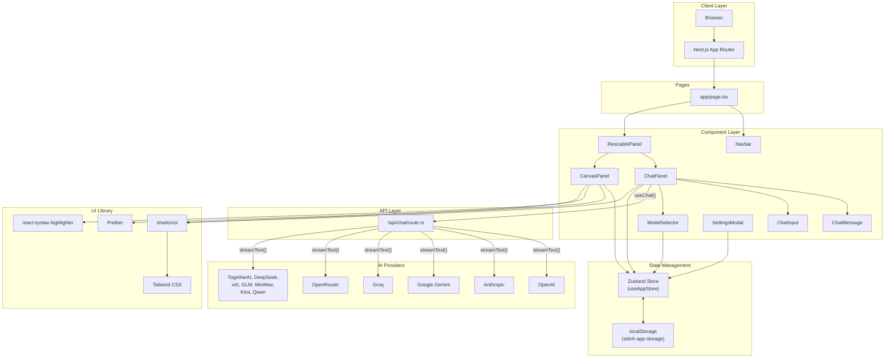
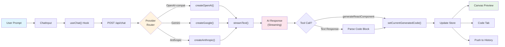
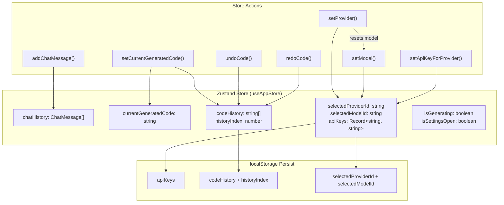

# UI Designer App — AI-Powered UI Component Generator

> A **Next.js 14** multi-provider AI-powered UI generator that converts natural language prompts into production-ready React components with live preview, syntax highlighting, and version history.


---

## Table of Contents

- [Features](#features)
- [Dev Stack](#dev-stack)
- [Project Statistics](#project-statistics)
- [System Architecture](#system-architecture)
- [Project Structure](#project-structure)
- [Configuration](#configuration)
- [Getting Started](#getting-started)
- [Available Scripts](#available-scripts)
- [Component List](#component-list)
- [Supported AI Providers](#supported-ai-providers)
- [SEO Optimization](#seo-optimization)
- [Security Notes](#security-notes)
- [License](#license)

---

## Features

### Core Features

- **AI-Powered UI Generation** — Generate complete React components from natural language descriptions
- **Multi-Provider Support** — 12 AI providers including OpenAI, Anthropic, Google Gemini, Groq, OpenRouter, and more
- **Live Preview Canvas** — Real-time iframe-based rendering of generated components with Tailwind CSS + React 18
- **Code History & Version Control** — Full undo/redo support with persistent history across sessions
- **Syntax Highlighting** — Prettier-formatted code with `react-syntax-highlighter` (VS Code Dark+ theme)
- **Image-to-Code** — Upload wireframes or mockups and generate components from visual input
- **Iterative Editing** — Modify existing generated code through follow-up prompts

### UI/UX Features

- **Resizable Panels** — Drag-to-resize split layout between chat and canvas
- **Dark Mode** — Automatic theme switching via CSS variables
- **Responsive Design** — Adapts seamlessly to different screen sizes
- **Auto-expanding Input** — Smart textarea that grows with content
- **Skeleton Loaders** — Loading placeholders during code generation
- **Copy & Download** — One-click code copying and `.tsx` file download
- **Model Search/Filter** — Searchable model dropdown for providers with large catalogs (e.g., OpenRouter)

### Technical Features

- **BYOK (Bring Your Own Key)** — Users provide their own API keys per provider
- **State Persistence** — Chat history, code history, API keys, and preferences survive page reloads via Zustand + localStorage
- **Streaming Responses** — Real-time token streaming via Vercel AI SDK
- **Tool Calling** — Structured `generateReactComponent` and `askClarificationQuestion` tools for reliable code output
- **TypeScript** — Full type safety across the entire codebase

---

## Dev Stack

| Layer | Technology | Purpose |
|-------|------------|---------|
| **Framework** | `Next.js 14` (App Router) | Full-stack React framework with API routes |
| **Language** | `TypeScript 5` | Static typing and IDE support |
| **Styling** | `Tailwind CSS 3.4` | Utility-first CSS framework |
| **UI Components** | `shadcn/ui 4.7` | Accessible, customizable component library |
| **State Management** | `Zustand 5.0` | Lightweight global state with persistence |
| **AI SDK** | `Vercel AI SDK 6.0` | Multi-provider streaming, tool calling |
| **Provider SDKs** | `@ai-sdk/openai`, `@ai-sdk/google`, `@ai-sdk/anthropic` | Native provider integrations |
| **Code Formatting** | `Prettier 3.3` | In-browser code formatting |
| **Syntax Highlighting** | `react-syntax-highlighter 15.6` | Prism-based code display |
| **Icons** | `Lucide React 1.14` | Consistent icon system |
| **Utilities** | `clsx`, `tailwind-merge` | Conditional classnames |

### Key Dependencies

```json
{
  "next": "14.2.35",
  "react": "^18",
  "ai": "^6.0.182",
  "@ai-sdk/openai": "^3.0.63",
  "@ai-sdk/google": "^3.0.73",
  "@ai-sdk/anthropic": "^3.0.77",
  "zustand": "^5.0.13",
  "shadcn": "^4.7.0",
  "prettier": "^3.3.3",
  "react-syntax-highlighter": "^15.6.1",
  "lucide-react": "^1.14.0"
}
```

---

## Project Statistics

| Metric | Value |
|--------|-------|
| **Total Source Files** | 36 |
| **Lines of Code** | ~2,435 |
| **Custom Components** | 10 |
| **shadcn/ui Components** | 9 |
| **AI Providers Supported** | 12 |
| **Total Models Available** | 50+ |
| **Zustand Store Slices** | 1 (unified) |
| **API Routes** | 1 (`/api/chat`) |
| **Languages** | TypeScript (100%) |
| **State Persistence** | localStorage via Zustand `persist` |

---

## System Architecture

### Component Architecture



### Data Flow



### State Management



---

## Project Structure

```
├── app/
│   ├── api/
│   │   └── chat/
│   │       └── route.ts          # Multi-provider streaming API route
│   ├── page.tsx                  # Main layout with resizable panels
│   ├── globals.css               # Global styles + CSS variables
│   ├── layout.tsx                # Root layout with SEO metadata
│   ├── robots.ts                 # Dynamic robots.txt generation
│   ├── sitemap.ts                # Dynamic sitemap.xml generation
│   └── favicon.ico               # App favicon
├── components/
│   ├── ui/                       # shadcn/ui components
│   │   ├── button.tsx
│   │   ├── input.tsx
│   │   ├── textarea.tsx
│   │   ├── dialog.tsx
│   │   ├── tabs.tsx
│   │   ├── scroll-area.tsx
│   │   ├── skeleton.tsx
│   │   ├── select.tsx
│   │   └── tooltip.tsx
│   ├── chat/
│   │   ├── ChatPanel.tsx         # Main chat with useChat() hook
│   │   ├── ChatMessage.tsx       # Message bubbles (text, images, tools)
│   │   └── ChatInput.tsx         # Auto-expanding textarea input
│   ├── canvas/
│   │   └── CanvasPanel.tsx       # Preview + code tabs with undo/redo
│   ├── ModelSelector.tsx         # Provider/model dropdown with search
│   ├── navbar.tsx                # Top navigation bar
│   ├── resizable-panel.tsx       # Draggable split panel
│   └── settings-modal.tsx        # Global API key settings
├── lib/
│   ├── models-registry.ts        # Provider/model constants (12 providers, 50+ models)
│   ├── parse-code-block.ts       # Extract code from markdown responses
│   └── utils.ts                  # cn() utility for classnames
├── store/
│   └── useAppStore.ts            # Zustand store with persistence
├── components.json               # shadcn/ui configuration
├── tailwind.config.ts            # Tailwind CSS configuration
├── tsconfig.json                 # TypeScript configuration
└── package.json                  # Dependencies and scripts
```

---

## Configuration

### shadcn/ui (`components.json`)

```json
{
  "style": "base-nova",
  "rsc": true,
  "tsx": true,
  "tailwind": {
    "config": "tailwind.config.ts",
    "css": "app/globals.css",
    "baseColor": "neutral",
    "cssVariables": true
  },
  "iconLibrary": "lucide"
}
```

### Tailwind CSS

- **Content paths**: `./app/**/*.{js,ts,jsx,tsx,mdx}`, `./components/**/*.{js,ts,jsx,tsx,mdx}`
- **Base color**: Neutral
- **CSS variables**: Enabled for theme switching
- **Dark mode**: Class-based

### TypeScript (`tsconfig.json`)

- **Strict mode**: Enabled
- **Path alias**: `@/*` maps to project root
- **Target**: ES2017
- **Module resolution**: Bundler

### Zustand Persistence

Persisted fields via `partialize`:

- `apiKeys` — Per-provider API keys
- `codeHistory` — Array of all generated code versions
- `historyIndex` — Current position in code history
- `selectedProviderId` — Last selected AI provider
- `selectedModelId` — Last selected model

### Environment Variables

| Variable | Description | Default |
|----------|-------------|---------|
| `NEXT_PUBLIC_SITE_URL` | Production site URL for SEO metadata | `https://uidesigner.app` |

---

## Getting Started

### Prerequisites

- **Node.js** 18.x or later
- **npm** / **yarn** / **pnpm**
- At least one **AI provider API key** (OpenAI, Anthropic, Google, Groq, OpenRouter, etc.)

### Installation

```bash
# 1. Clone the repository
git clone <repository-url>
cd ui-designer

# 2. Install dependencies
npm install

# 3. Start the development server
npm run dev

# 4. Open in browser
# Navigate to http://localhost:3000
```

### Configuration Steps

1. **Select a Provider** — Choose an AI provider from the dropdown in the chat panel
2. **Select a Model** — Pick a model (free models are marked, OpenRouter supports search)
3. **Enter API Key** — Input your API key for the selected provider (link provided for OpenRouter)
4. **Start Generating** — Type a prompt describing the UI you want to build

### Example Prompts

- `"Create a login form with email and password fields using shadcn/ui"`
- `"Build a pricing card with three tiers and a toggle for monthly/yearly"`
- `"Generate a responsive navbar with a mobile hamburger menu"`
- `"Make a dashboard with a sidebar, stats cards, and a data table"`

---

## Available Scripts

| Command | Description |
|---------|-------------|
| `npm run dev` | Start development server (hot reload) |
| `npm run build` | Build optimized production bundle |
| `npm run start` | Start production server |
| `npm run lint` | Run ESLint checks |

---

## Component List

### shadcn/ui Components

| Component | Status | Usage |
|-----------|--------|-------|
| `Button` | Installed | Action triggers, icon buttons |
| `Input` | Installed | API key input, search filter |
| `Textarea` | Installed | Chat input field |
| `Dialog` | Installed | Settings modal |
| `Tabs` | Installed | Preview / Code tab switcher |
| `ScrollArea` | Installed | Code view scrolling |
| `Skeleton` | Installed | Loading placeholders |
| `Select` | Installed | Provider/model dropdowns |
| `Tooltip` | Installed | Button hover hints |

### Custom Components

| Component | File | Description |
|-----------|------|-------------|
| `Navbar` | `components/navbar.tsx` | Top bar with logo and settings trigger |
| `ResizablePanel` | `components/resizable-panel.tsx` | Draggable split between chat and canvas |
| `SettingsModal` | `components/settings-modal.tsx` | Global API key configuration dialog |
| `ChatPanel` | `components/chat/ChatPanel.tsx` | Main chat interface with `useChat()` |
| `ChatMessage` | `components/chat/ChatMessage.tsx` | Message bubbles (text, images, tool calls) |
| `ChatInput` | `components/chat/ChatInput.tsx` | Auto-expanding textarea with send button |
| `CanvasPanel` | `components/canvas/CanvasPanel.tsx` | Preview iframe + formatted code view |
| `ModelSelector` | `components/ModelSelector.tsx` | Provider/model picker with search and API key input |

---

## Supported AI Providers

| Provider | ID | Base URL | Free Models | Paid Models |
|----------|----|----------|:-----------:|:-----------:|
| **OpenRouter** | `openrouter` | `openrouter.ai/api/v1` | 8 | 4 |
| **Groq** | `groq` | `api.groq.com/openai/v1` | 5 | 0 |
| **TogetherAI** | `togetherai` | `api.together.ai/v1` | 4 | 2 |
| **DeepSeek** | `deepseek` | `api.deepseek.com/v1` | 2 | 0 |
| **OpenAI** | `openai` | `api.openai.com/v1` | 0 | 4 |
| **Google Gemini** | `gemini` | `generativelanguage.googleapis.com/v1beta` | 3 | 2 |
| **xAI (Grok)** | `xai` | `api.x.ai/v1` | 1 | 2 |
| **Anthropic (Claude)** | `anthropic` | `api.anthropic.com/v1` | 0 | 5 |
| **GLM (Zhipu)** | `glm` | `open.bigmodel.cn/api/paas/v4` | 4 | 0 |
| **MiniMax** | `minimax` | `api.minimax.chat/v1` | 3 | 0 |
| **Kimi (Moonshot)** | `kimi` | `api.moonshot.cn/v1` | 3 | 0 |
| **Qwen (Alibaba)** | `qwen` | `dashscope.aliyuncs.com/compatible-mode/v1` | 4 | 1 |

### Provider Routing Logic

- **OpenAI-compatible** (OpenRouter, Groq, TogetherAI, DeepSeek, xAI, GLM, MiniMax, Kimi, Qwen) → Uses `createOpenAI()` with dynamic `baseURL` and `apiKey`
- **Google Gemini** → Uses `createGoogle()` from `@ai-sdk/google`
- **Anthropic Claude** → Uses `createAnthropic()` from `@ai-sdk/anthropic`

---

## SEO Optimization

### Implemented SEO Features

- **Meta Tags** — Comprehensive title, description, keywords, authors, and canonical URLs
- **Open Graph** — Full OG tags for social media sharing (title, description, image, locale)
- **Twitter Cards** — `summary_large_image` card with creator handle
- **Robots.txt** — Dynamic generation via `app/robots.ts`, allows all crawlers
- **Sitemap.xml** — Dynamic generation via `app/sitemap.ts` with daily update frequency
- **Viewport** — Theme color, device-width, scale limits
- **Preconnect** — DNS prefetch hints for performance

### SEO Files

| File | Type | Description |
|------|------|-------------|
| `app/layout.tsx` | Metadata export | Title template, OG, Twitter, robots, canonical |
| `app/robots.ts` | Dynamic route | Generates `/robots.txt` allowing all crawlers |
| `app/sitemap.ts` | Dynamic route | Generates `/sitemap.xml` with all pages |

### Environment Setup

Set `NEXT_PUBLIC_SITE_URL` to your production domain for proper canonical URLs and OG tags.

---

## Security Notes

- **API keys** are stored in `localStorage` via Zustand persistence (not cookies)
- Keys are **never sent to third-party servers** — only transmitted to the selected AI provider's API
- Each provider's key is stored separately in a `Record<string, string>` map
- Clear keys anytime via the **Settings** modal
- API routes validate all inputs before processing
- The preview iframe uses `sandbox="allow-scripts"` for isolation

---

## License

This project is for **educational purposes**. All trademarks belong to their respective owners.
